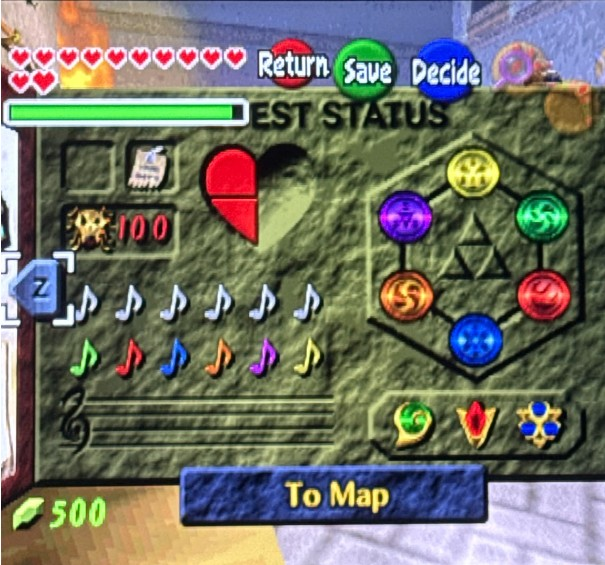
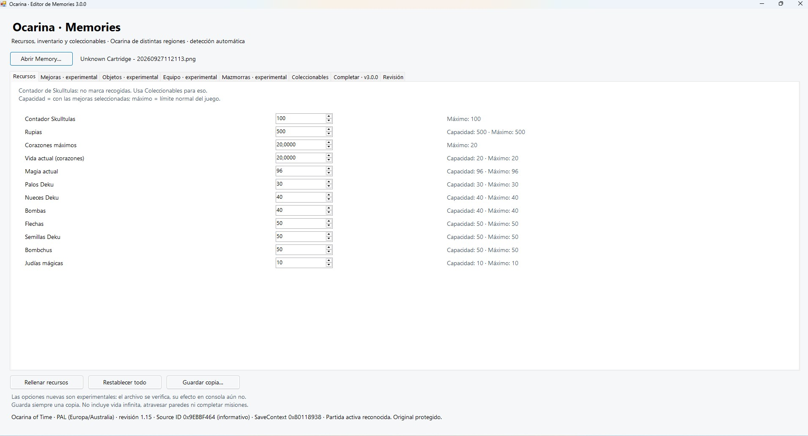
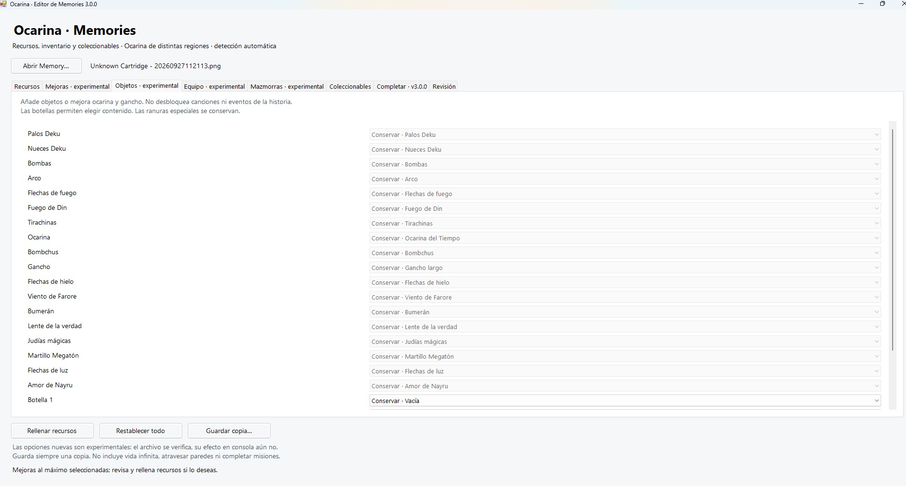
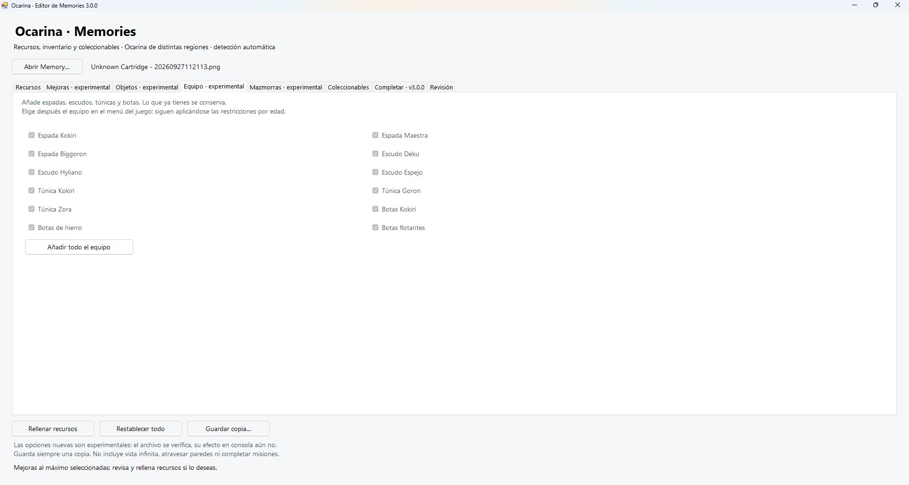
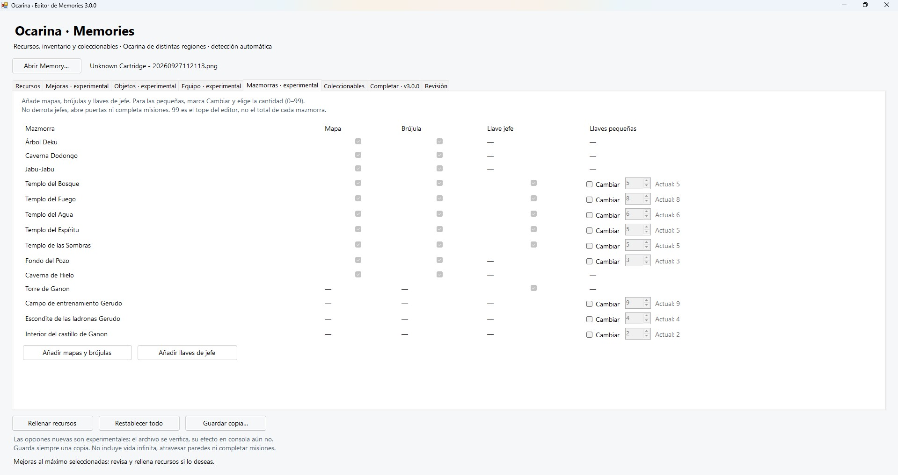
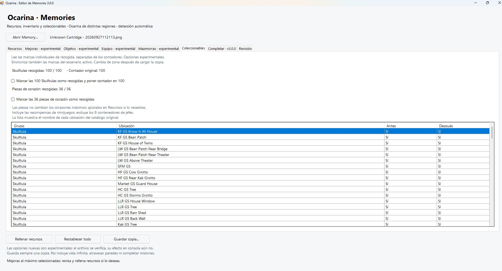

# Ocarina Memory Editor for Analogue 3D — v3.0.0

  

Windows editor for **The Legend of Zelda: Ocarina of Time** Memories created by Analogue 3D / 3DOS.

> Independent fan-made utility. It does not contain ROMs, Nintendo game data, firmware, or Analogue software. The Legend of Zelda, Ocarina of Time and Nintendo are trademarks of their respective owners. Analogue and Analogue 3D are trademarks of their respective owners. This project is not affiliated with or endorsed by Nintendo or Analogue.

## Screenshots

### Resources

### Items

### Equipment

### Dungeons

### Collectibles

## What it does

It opens an original Analogue 3D Memory PNG, locates the live Ocarina of Time SaveContext structurally, lets you edit supported game-state fields, recalculates the OoT checksum and Analogue `apmd` CRC, then writes a **new copy**. The source Memory is never overwritten by the application.

The detector does **not** select a save using a fixed SaveContext address, cartridge/source ID, build string, region whitelist, checksum validity, or “second ZELDAZ” rule. It searches the captured RDRAM for candidates and selects a unique structurally coherent live SaveContext. Ambiguous detection is rejected.

## Verified builds

Regression-tested with real Memories from:

- NTSC-U 1.0
- NTSC-U 1.1
- NTSC-U 1.2
- PAL 1.0
- PAL 1.1
- Master Quest PAL / GameCube build

These are verified samples, **not a whitelist**. ROM hacks/randomizers are not guaranteed because they can change the SaveContext layout, valid values or world-state semantics.

## Safety

1. Keep the original Memory.
2. Open the original `.png` produced by Analogue 3D; do not re-export it through an image editor.
3. Review the requested changes.
4. Save to a different filename/path. Existing files are not overwritten.
5. The written copy is reopened and verified before completion.
6. After loading an edited Memory on the console, change area, save normally in-game and reload the normal save when appropriate.

The checksum of a **live** SaveContext may legitimately be stale at capture time. That fact is diagnostic and is not used to reject the live candidate. A newly written Memory must pass the editor's integrity checks.

## Run

Extract the ZIP and run `MemoryEditor.exe` on Windows with .NET Framework 4.x.

## Source

The C# source used for the public build is included in `source/`. `Compilar.ps1` builds the Windows executable with the .NET Framework C# compiler.

Technical detector and regression notes from the validated v2.5.2 base are included in `docs/`.

## Support / donations

The utility is intended to be distributed free of charge. Optional donations may be enabled on the project's itch.io page.

## License

No open-source license has been selected yet. Source is included for transparency and reproducibility. Do not redistribute modified builds as official releases without the author's permission.
